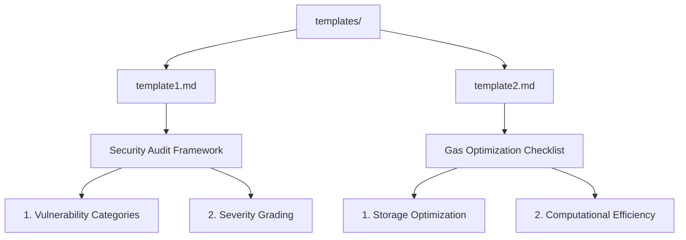

# Smart Contract Audit Template Repository
# Current audit report project moved to this repo.

## Purpose
This repository contains standardized templates for conducting blockchain smart contract audits. Designed for security professionals and development teams to:
- Streamline code review processes
- Maintain consistent auditing standards
- Catalog vulnerabilities
- Generate compliance reports

**Supported Template Types:**
- Security Analysis Checklists
- Gas Optimization Assessments
- Compliance Verification (ERC standards)
- Risk Scoring Frameworks

## Template Structure


## Usage
1. Clone repository
2. Copy desired template:
```bash
cp templates/template1.md my_audit_report.md
```
3. Customize sections according to:
- Contract complexity
- Project requirements
- Compliance needs

Recommended workflow:
1. Pre-audit requirements gathering
2. Static analysis using template sections
3. Dynamic testing documentation
4. Final report generation

## Contributing
To add new templates:
1. Fork repository
2. Create new .md file in `/templates` with naming convention:
   `template[number]_[purpose].md`
3. Include these mandatory sections:
   - Audit Scope Definition
   - Testing Methodology
   - Findings Catalog
   - Risk Mitigation Strategies
4. Submit pull request

**Formatting Requirements:**
- Use markdown headings (## Level 2)
- Tables for vulnerability categorization
- Code blocks for example contract snippets
