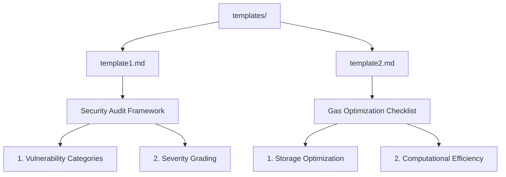

<!--
███████╗██╗      █████╗ ███╗   ███╗ ██████╗ ████████╗      ██████╗ ███████╗
██╔════╝██║     ██╔══██╗████╗ ████║██╔═══██╗╚══██╔══╝     ██╔═══██╗██╔════╝
█████╗  ██║     ███████║██╔████╔██║██║   ██║   ██║        ██║   ██║███████╗
██╔══╝  ██║     ██╔══██║██║╚██╔╝██║██║   ██║   ██║        ██║   ██║╚════██║
██║     ███████╗██║  ██║██║ ╚═╝ ██║╚██████╔╝   ██║        ╚██████╔╝███████║
╚═╝     ╚══════╝╚═╝  ╚═╝╚═╝     ╚═╝ ╚═════╝    ╚═╝         ╚═════╝ ╚══════╝
-->
<p align="center">
  
  
  
</p>

# Smart Contract Audit Template Repository

---

## 📑 Table of Contents

- [Smart Contract Audit Template Repository](#smart-contract-audit-template-repository)
  - [📑 Table of Contents](#-table-of-contents)
  - [📄 Purpose](#-purpose)
  - [🗂️ Template Structure](#️-template-structure)
    - [🌟 Supported Template Types](#-supported-template-types)
  - [🚀 Usage](#-usage)
  - [🤝 Contributing](#-contributing)
  - [📝 License](#-license)
  - [🙏 Acknowledgements](#-acknowledgements)

---

## 📄 Purpose

This repository provides standardized templates to streamline blockchain smart contract audits for security professionals and development teams.

✨ **Main goals:**
- Maintain consistent and comprehensive auditing standards
- Streamline code review processes
- Catalog vulnerabilities and recommendations
- Enable easy compliance reporting

---

## 🗂️ Template Structure

Below is a visualization of the template architecture:


*<sup>Directory tree for easy navigation</sup>*

### 🌟 Supported Template Types

| Type                          | Icon   | Description                                     |
|-------------------------------|--------|-------------------------------------------------|
| Security Analysis Checklist   | ✅     | Vulnerability categories & grading               |
| Gas Optimization Assessment   | ⛽     | Storage & computational efficiency               |
| Compliance Verification       | 📜     | Ensures adherence to ERC and protocol standards  |
| Risk Scoring Framework        | ⚠️     | Severity, impact and risk metadata               |

---

## 🚀 Usage

1. **Clone repository**
2. **Copy the desired template:**

```bash
cp templates/template1.md my_audit_report.md
```

3. **Customize sections according to:**
   - Contract complexity
   - Project requirements
   - Compliance needs

> 💡 **Recommended Workflow**
> 1. Pre-audit requirements gathering
> 2. Static analysis (use provided template sections)
> 3. Dynamic testing documentation
> 4. Final report generation

---

## 🤝 Contributing

Want to add your own auditing template? Follow this process:

- [ ] **Fork this repository**
- [ ] **Create a new .md file in `/templates`**
   - **Naming:** `template[number]_[purpose].md`
- [ ] **Include the following mandatory sections:**

| Section                   | Description                                  |
|---------------------------|----------------------------------------------|
| Audit Scope Definition    | What is covered by this audit                |
| Testing Methodology       | Static/dynamic analysis steps                |
| Findings Catalog          | Table/list of findings                       |
| Risk Mitigation Strategies| Recommendations for remediation              |

- [ ] **Submit a pull request (PR)**

> **Formatting Tips:**
> - Use `##` for all section headers.
> - Employ markdown tables for findings and vulnerability severity.
> - Format code blocks with language annotation for syntax highlighting.
> - Keep structure clean and consistent!

---

## 📝 License

This repository is licensed under the [MIT License](LICENSE).

---

## 🙏 Acknowledgements

- Inspired by secure software and blockchain auditing best practices.
- Built for and with the community—contributions always welcome!
