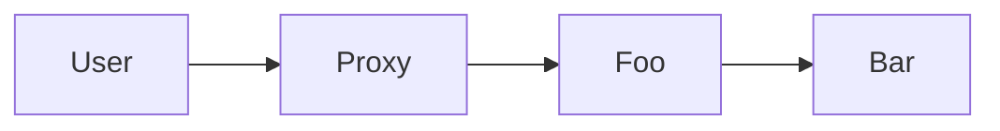
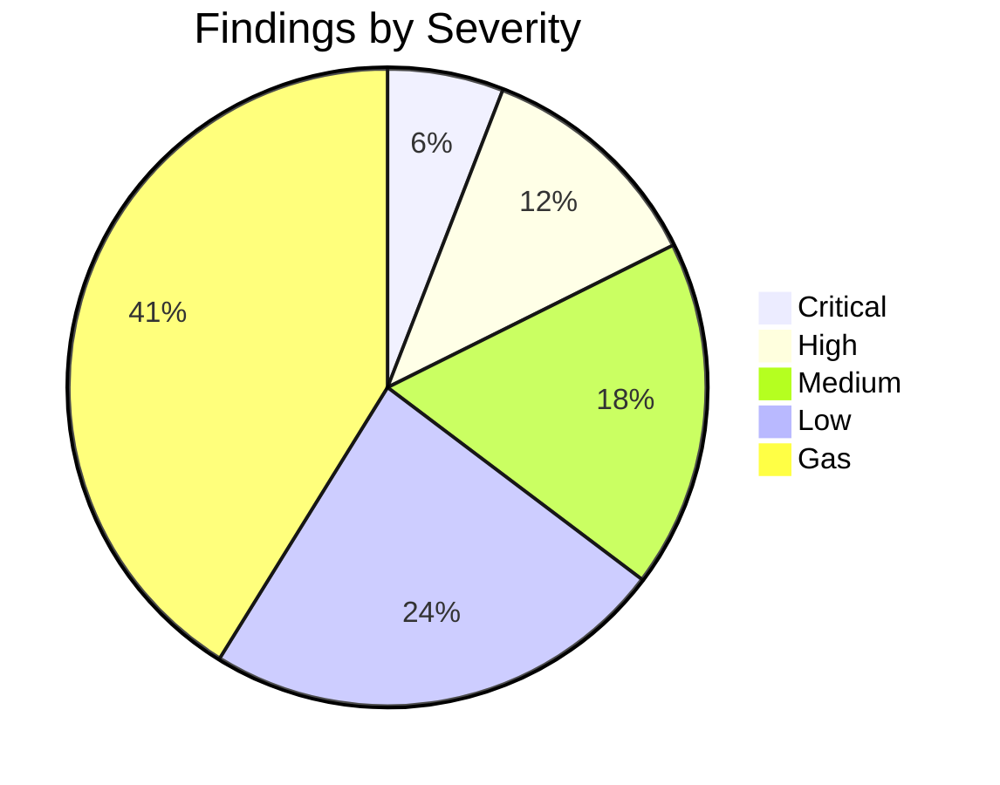

<!-- ================================================================== -->
<!--           Code4rena Smart-Contract Audit Report Template           -->
<!--               Replace ✏️  … placeholders before submit             -->
<!-- ================================================================== -->

# 📝 Title & Metadata  
- **Contest**: ✏️ Code4rena — *e.g.* “2024-05 FooBar Protocol Contest”  
- **Repository**: ✏️ `<repo-url>`  
- **Commit / Tag Audited**: ✏️ `<sha / tag>`  
- **Auditors / Team**: ✏️ `<handle(s)>`  
- **Date**: ✏️ `<YYYY-MM-DD>`  

---

## Table of Contents
- [📝 Title \& Metadata](#-title--metadata)
  - [Table of Contents](#table-of-contents)
  - [1. Introduction](#1-introduction)
  - [2. Scope](#2-scope)
  - [3. System Overview](#3-system-overview)
  - [4. Methodology](#4-methodology)
  - [5. Severity Classification](#5-severity-classification)
  - [6. Findings Summary](#6-findings-summary)
  - [7. Detailed Findings](#7-detailed-findings)
    - [7.1 ✏️ Critical: Balance mismatch lets attacker drain pool](#71-️-critical-balance-mismatch-lets-attacker-drain-pool)
      - [Exploit Scenario](#exploit-scenario)
      - [Recommendation](#recommendation)
      - [Developer Response](#developer-response)
  - [8. Gas \& Efficiency Notes](#8-gas--efficiency-notes)
  - [9. Recommendations / Best Practices](#9-recommendations--best-practices)
  - [10. References](#10-references)
  - [11. Disclaimer](#11-disclaimer)

---

## 1. Introduction
Provide a short, high-level description of the audit, its goals, and the tested commit.

> Example:  
> “This report documents the security review performed on FooBar Protocol’s smart contracts during the Code4rena 2024-05 contest. Our objective was to identify vulnerabilities, logic errors, gas optimizations, and general best-practice deviations.”

---

## 2. Scope
| File / Contract | SLOC | Purpose / Notes |
|-----------------|------|-----------------|
| ✏️ `contracts/Foo.sol` | 123 | Core staking |
| ✏️ `contracts/Bar.sol` | 210 | Reward logic |
| … | … | … |

Out-of-scope: ✏️ *list*  
Used commit: `✏️ <sha>`

---

## 3. System Overview
Describe how contracts interact, main components, and external dependencies. Diagrams welcome!

---

## 4. Methodology
Briefly explain your audit process:

- Static analysis tools: ✏️ Slither, MythX, Foundry-audit, etc.  
- Manual line-by-line review  
- Differential fuzzing / property-based tests  
- Unit / integration tests executed: `forge test -vv`

---

## 5. Severity Classification
We map to Code4rena’s standard:

| Level        | Criteria (Condensed)                                                        |
|--------------|-----------------------------------------------------------------------------|
| Critical     | Loss/theft of user funds or irreversible contract takeover                  |
| High         | Significant denial-of-service or incorrect profit calculation               |
| Medium       | Exploitable under specific conditions / edge cases                          |
| Low          | Best-practice deviation with limited impact                                 |
| Gas / QoF    | Pure gas savings & code quality improvements                                |
| Informational| No direct impact, docs / style suggestions                                  |

---

## 6. Findings Summary
| # | Title | Severity | Status* |
|---|-------|----------|---------|
| 1 | ✏️ Short title for critical issue | Critical | Unfixed |
| 2 | ✏️ Reentrancy in `withdraw()`    | High     | Fixed in PR #12 |
| … | … | … | … |

`*Status`: Fixed / Acknowledged / Not Fixed / N/A

---

## 7. Detailed Findings

### 7.1 ✏️ Critical: Balance mismatch lets attacker drain pool
**Location**: `Foo.sol:L123-160`  
**Impact**: Drains all deposited tokens.  

#### Exploit Scenario  
1. Attacker deposits via crafted contract …  
2. ✏️ …

#### Recommendation  
- Add re-entrancy guard.  
- Validate invariant `totalSupply == sum(balances)` after state changes.  

#### Developer Response  
> “Fixed in commit 0xabc; unit test added.”

---

_(Repeat this subsection for every issue, descending severity.)_

---

## 8. Gas & Efficiency Notes
| ID | Description | Est. Savings |
|----|-------------|--------------|
| G-1 | Use `unchecked {}` increment in `for` loop | ~34 gas / iteration |
| G-2 | Cache `storage` pointer to `memory`         | ~200 gas / call |

---

## 9. Recommendations / Best Practices
- Use `openzeppelin/upgradeable` `AccessControl` to reduce custom code.  
- Increase test coverage on overflow scenarios.  
- Document upgradeability risks in README.

---

## 10. References
- EIP-20, EIP-2535 Diamond Standard  
- Code4rena rules: https://docs.code4rena.com/competitions-judging  

---

## 11. Disclaimer
This audit is not a guarantee of security. Vulnerabilities may still exist. Use at your own risk.

---

<!-- ===================== END OF REPORT ============================= -->